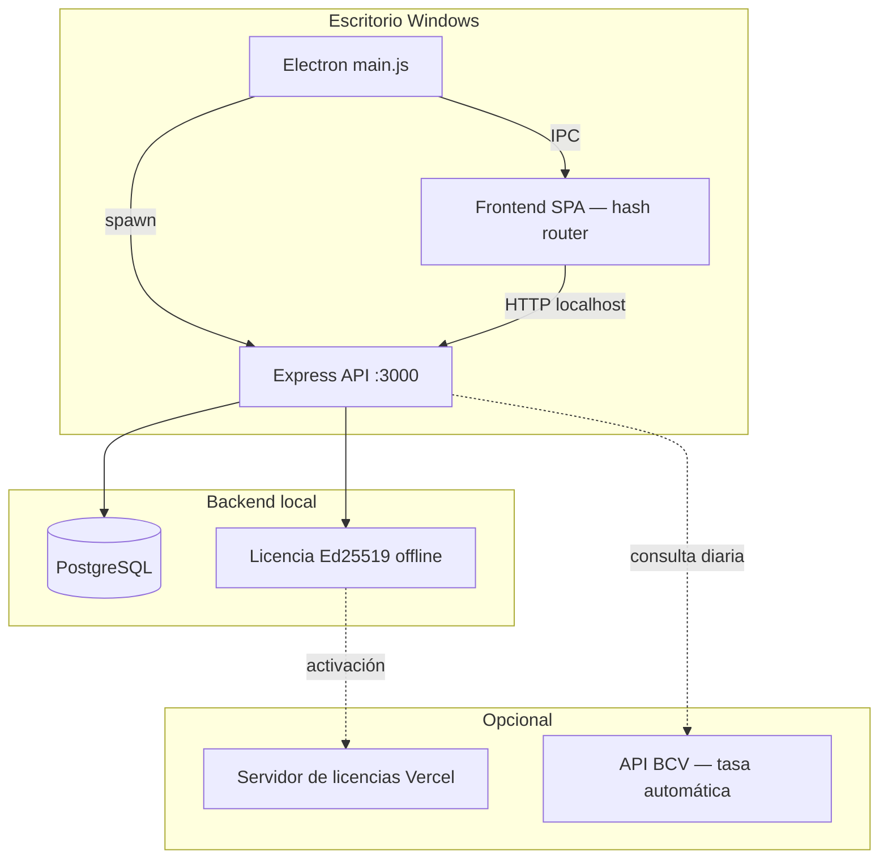

<p align="center">
  
</p>

<h1 align="center">Nexus Core</h1>

<p align="center">
  <strong>ERP y punto de venta de escritorio para comercios en Venezuela</strong><br>
  Inventario, ventas, caja, cartera, reportes y multimoneda BCV — en una sola aplicación Windows.
</p>

<p align="center">
  
  
  
  
  
</p>

---

## ¿Qué es Nexus Core?

Nexus Core es un sistema **ERP + POS** diseñado para el contexto venezolano: maneja tasas BCV, operación en bolívares y dólares de referencia, integración con **Cashea**, crédito a clientes, arqueos de caja y respaldos automáticos. Corre como aplicación de escritorio en Windows (7+) con backend Express embebido y base de datos PostgreSQL.

Pensado para tiendas, ferreterías, abastos y negocios que necesitan **control financiero real** — no un dashboard genérico — con trazabilidad de ventas, permisos por rol y cálculos de precio consistentes entre inventario y caja.

---

## Módulos

| Módulo | Descripción |
|--------|-------------|
| **Dashboard** | KPIs de ventas, gráficos y métricas en referencia **$ BCV** |
| **Punto de venta (POS)** | Cobro multimétodo, escáner de códigos de barras, descuentos y Cashea |
| **Caja** | Apertura, arqueo y cierre con control de sesión |
| **Inventario** | Productos, stock, costos y precios con cadena BCV/USD |
| **Ventas** | Historial, detalle, anulaciones y devoluciones |
| **Clientes** | Ficha, crédito y límites de descuento |
| **Cartera** | Cuentas por cobrar y abonos |
| **Cashea** | Cuotas, comisiones y niveles de financiamiento |
| **Compras** | Órdenes y recepción de mercancía |
| **Proveedores** | Catálogo de proveedores |
| **Reportes** | Exportación PDF/Excel y análisis operativo |
| **Configuración** | Empresa, tasas, impresoras, respaldos y modo de moneda |
| **Usuarios** | Roles, permisos granulares y auditoría |

---

## Características destacadas

### Finanzas y tasas
- **Tasa BCV** con historial en base de datos y actualización automática opcional (API pública, aplicación a medianoche Caracas).
- Modo **multimoneda** (tasa BCV + tasa USD operativa) o **solo BCV** (una sola tasa unificada).
- Cadena de precios sincronizada entre backend y frontend (`preciosService` ↔ `preciosClient`).
- Montos del dashboard y reportes en **referencia $ BCV**, alineados con la normativa operativa del negocio.

### Operación diaria
- POS con múltiples métodos de pago (efectivo Bs/USD, transferencia, pago móvil, Cashea, crédito).
- Control de **caja abierta** antes de vender; idempotencia en ventas para evitar duplicados.
- Impresión térmica de tickets y generación de facturas/notas en PDF.
- Respaldos `pg_dump` automáticos (al cerrar caja, al salir o por intervalo configurable).

### Seguridad y licenciamiento
- Autenticación JWT con permisos por rol y overrides por usuario.
- Licencias **Ed25519** con activación offline vinculada al hardware (HWID).
- Validación de secretos al arranque en producción; logs estructurados con Winston.

### Primera ejecución
- Asistente de configuración en 4 pasos: PostgreSQL → licencia → administrador → datos de empresa.
- Migraciones incrementales idempotentes (001–038+) aplicadas automáticamente al iniciar.

---

## Requisitos del sistema

| Componente | Versión mínima |
|------------|----------------|
| Windows | 7 SP1 o superior (64 bits) |
| Node.js | 18+ |
| npm | 8+ |
| PostgreSQL | 14+ (servicio local o remoto) |
| RAM | 4 GB recomendado |
| Disco | ~500 MB (app) + espacio para BD y respaldos |

> En builds empaquetados, Nexus Core puede incluir PostgreSQL portable en `extraResources`. Para desarrollo, se usa una instancia PostgreSQL ya instalada en el sistema.

---

## Inicio rápido (desarrollo)

### 1. Clonar e instalar

```powershell
git clone https://github.com/TU_USUARIO/nexuscore.git
cd nexuscore
npm install
```

### 2. Configurar entorno

```powershell
copy .env.example .env
```

Edita `.env` con al menos:

```env
JWT_SECRET=<genera uno de 48+ bytes hex>
PG_HOST=127.0.0.1
PG_PORT=5432
PG_DATABASE=nexuscore
PG_USER=postgres
PG_PASSWORD=<tu contraseña>
PORT=3000
NODE_ENV=development
```

Generar un `JWT_SECRET` seguro:

```powershell
node -e "console.log(require('crypto').randomBytes(48).toString('hex'))"
```

### 3. Base de datos

Crea la base de datos en PostgreSQL:

```sql
CREATE DATABASE nexuscore;
```

Al arrancar la app, Nexus Core ejecuta el bootstrap de esquema y los parches de migración automáticamente.

### 4. Ejecutar

```powershell
# Aplicación completa (Electron + backend embebido)
npm start

# Solo backend (depuración API)
npm run backend
```

La primera vez se abrirá el **asistente de configuración** (`setup.html`) si faltan credenciales de PostgreSQL o datos iniciales.

---

## Compilar instalador Windows

```powershell
# Generar iconos desde el logo oficial
npm run icons

# Instalador NSIS + versión portable → carpeta dist/
npm run dist

# Solo instalador NSIS
npm run dist:nsis

# Solo portable (sin instalador)
npm run dist:portable
```

El empaquetado incluye migraciones SQL, branding e iconos. Ver [`build-resources/README.md`](build-resources/README.md) para detalles del instalador y firma de código.

---

## Arquitectura



| Capa | Tecnología |
|------|------------|
| Escritorio | Electron 36 |
| UI | HTML/CSS/JS vanilla (SPA por hash) |
| API | Express 4, pg-promise |
| Base de datos | PostgreSQL con migraciones versionadas |
| PDF / reportes | jsPDF, ExcelJS, html2canvas |
| Impresión | node-thermal-printer |
| Escáner | QuaggaJS + JsBarcode |

---

## Estructura del proyecto

```
nexuscore/
├── electron/           # Proceso principal Electron, IPC, setup, respaldos
├── frontend/           # SPA: páginas, componentes, estilos, servicios cliente
├── backend/            # API Express: controladores, servicios, middleware
├── database/
│   └── migrations/     # Parches SQL incrementales (001–038+)
├── resources/templates/  # Plantillas HTML para facturas y notas
├── license-server/     # Servidor de activación Ed25519 (despliegue Vercel)
├── build-resources/    # Iconos e instalador NSIS
├── scripts/            # Utilidades de build, iconos y reset de BD
└── docs/               # Documentación técnica interna
```

---

## Variables de entorno

Referencia completa en [`.env.example`](.env.example). Variables principales:

| Variable | Propósito |
|----------|-----------|
| `JWT_SECRET` | Firma de tokens de sesión (obligatorio en producción) |
| `PG_*` | Conexión a PostgreSQL |
| `PORT` | Puerto del API local (default `3000`) |
| `NODE_ENV` | `development` \| `production` |
| `NEXUS_BACKUP_INTERVAL_MINUTES` | Intervalo de respaldo automático (0 = desactivado) |
| `NEXUS_TASA_BCV_AUTO` | Activar sincronización automática de tasa BCV |
| `NEXUS_LICENSE_PUBLIC_KEY` | Clave pública Ed25519 para verificar licencias |
| `NEXUS_FORCE_SETUP` | Forzar asistente de primera ejecución |

> **Importante:** el archivo `.env` nunca debe subirse al repositorio. En producción empaquetada, la configuración de PostgreSQL se guarda en `userData/config.env`.

---

## Scripts npm

| Comando | Acción |
|---------|--------|
| `npm start` | Inicia Electron con backend embebido |
| `npm run backend` | Solo servidor Express |
| `npm run icons` | Genera `icon.ico` / `icon.png` desde el logo |
| `npm run dist` | Build NSIS + portable |
| `npm run pack` | Build sin empaquetar (carpeta `dist/win-unpacked`) |
| `npm run db:reset` | Reinicia la base de datos (destructivo) |

---

## Servidor de licencias

El directorio [`license-server/`](license-server/) contiene el microservicio de activación desplegable en Vercel. Genera claves firmadas con Ed25519 que Nexus Core valida **offline** en cada equipo.

```powershell
cd license-server
npm install
# Configurar variables según license-server/.env.example
```

---

## Seguridad

- En `NODE_ENV=production`, el servidor **aborta** si `JWT_SECRET` está vacío o usa el valor de desarrollo por defecto.
- Las respuestas de error en producción no exponen stack traces ni estructura interna de la BD.
- Los tokens, contraseñas y HWIDs completos no se registran en logs.
- Toda escritura crítica (ventas, inventario, caja, cartera) se ejecuta dentro de transacciones `db.tx()`.

---

## Desarrollo

### Convenciones del código

- Backend: `async/await`, `asyncHandler` en rutas, logging con Winston (sin `console.log` en producción).
- Utilidades duales sincronizadas entre `backend/utils/` y `frontend/services/` (teléfono VE, precios, validadores).
- Migraciones congeladas 001–026: cambios de esquema nuevos van en archivos `027+` idempotentes.
- Identidad visual: acento ámbar `#f0a500`, tipografía Sora/Barlow/DM Mono, sin estética neon/cyan.

### Reset de base de datos (solo desarrollo)

```powershell
npm run db:reset -- --confirm
```

---

## Licencia

Este repositorio es **software propietario** (`"private": true`). El código fuente, la marca Nexus Core y el sistema de licencias Ed25519 están protegidos. No está autorizada la redistribución, modificación ni uso comercial sin licencia válida.

Para activación comercial o soporte, contacta al titular del proyecto.

---

<p align="center">
  <sub>Nexus Core · ERP · POS · Hecho para el comercio venezolano</sub>
</p>
